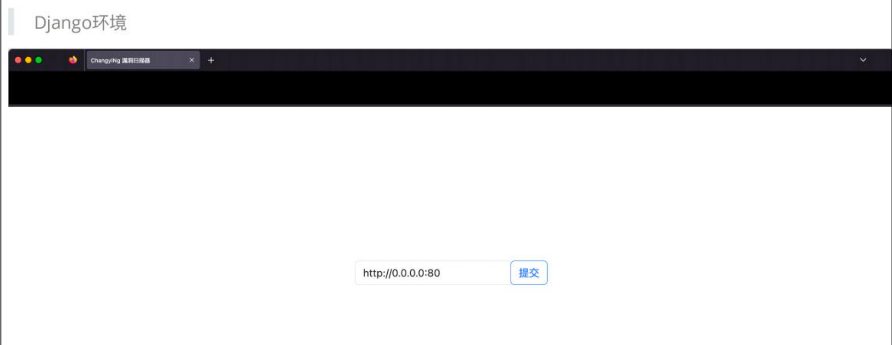
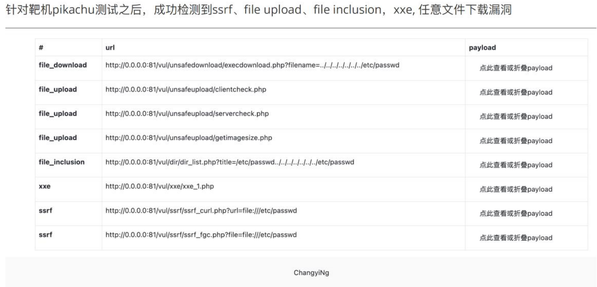

# Ch4ngyiNg

华为杯Web通用漏洞检测题目练手项目，开发周期不是很长，代码逻辑比较简单。

## 部署安装

> python 版本 3.10.12

~~~markdown
# 解压后进入文件夹
$ cd Ch4ngyiNg

# 安装依赖
$ pip3 install -r requirements

# 启动服务 默认127.0.0.1:8000
$ python3 manage.py runserver

# 输入待检测的url http://xxx.xxx

~~~

**访问部署的url**

